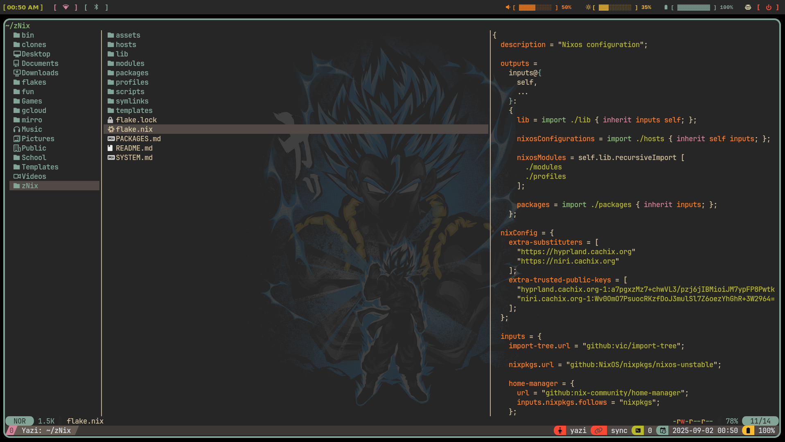

# Dotfiles

This repository contains the dot and nix files that build into my system with my
preferences. Instructions on how to reproduce my configuration are below.

(Credits are at the end)

## Previews

<details>
<summary>Hyprlock (based on Catppuccin)</summary>
  

</details>

<details>
<summary>Hyprland tiling</summary>
  

</details>

<details>
<summary>Hyprpanel</summary>
  

</details>

<details>
<summary>Wofi</summary>
  

</details>

<details>
  <summary>Yazi</summary>
  
    
</details>


## Directory Structure

The `system/` directory contain `configuration.nix` and
`hardware-configuration.nix` files for building my system. Note that
`hardware-configuration.nix` is automatically generated by your system if using
NixOS. To generate it manually,
[check out the command](https://nixos.wiki/wiki/Nixos-generate-config)
`nixos-generate-config`.

Most other directories at the root level are the config folders for applications
I use (like Hyprland, Yazi, etc). These are symlinked to their correct locations
(typically in `~/.config/...`) by Home Manager (see
[`home.nix`](https://github.com/zSuperx/dotfiles/blob/master/home.nix#L29))

For this repository, a function called `homelink` is defined which makes a call
to `config.lib.file.mkOutOfStoreSymlink`. While impure, this allows config files
(like `hypr/hyprland.conf`) to be hot-reloaded upon file save, rather than
requiring a system rebuild.

## Building

### System

Both the system and home-manager configurations are built and managed through
Nix Flakes.

To build, first clone the repo:

```console
git clone git@github.com:zSuperx/dotfiles.git
```

Then, granted you have [flake support enabled](https://nixos.wiki/wiki/flakes)
in NixOS, you can just run the standard rebuild command but with the flake
argument:

```console
sudo nixos-rebuild switch --flake ./dotfiles
```

### Neovim

Since I use NVF to manage Neovim, its options, and its plugins, the following
command can be used to launch my Neovim config. Great for testing it out!

```console
nix run github:zSuperx/dotfiles#neovim
```

## Credits

I am not a creative person lol. Here are the links I took some configs or
inspiration from:

- [wofi](https://github.com/7KIR7/dots/tree/main)
- [hyprpanel](https://github.com/Jas-SinghFSU/HyprPanel)
- [hyprlock](https://github.com/catppuccin/hyprlock)
